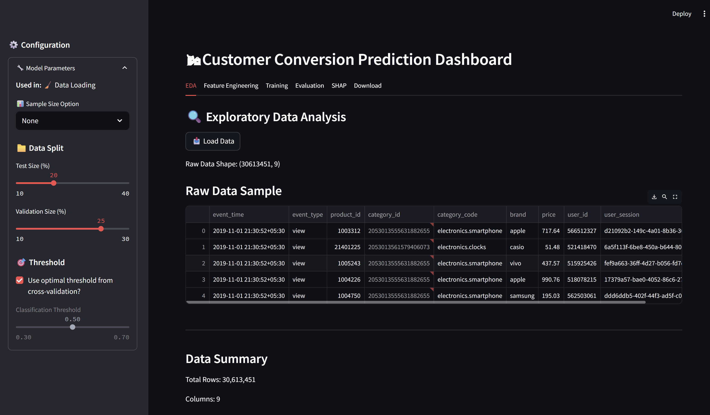

# 🛒 End-to-End Customer Behavior Analysis & Prediction Platform

**A Modular E-commerce Machine Learning Platform for Customer Targeting, Explainable AI, and Business Impact**

---

## 🚀 Overview

This project implements a **comprehensive, production-ready machine learning pipeline** to analyze customer behavior and predict purchase intent in an e-commerce setting. It combines advanced feature engineering, robust model evaluation, explainable AI, and production-grade engineering practices to deliver actionable insights for customer segmentation, personalized targeting, and business strategy.

The platform features a **REST API** for real-time predictions, **comprehensive data validation** with Pydantic schemas, **MLflow experiment tracking**, and an **interactive Streamlit dashboard**. It's designed for clarity, reproducibility, scalability, and business relevance—integrating data science best practices with industry-standard software engineering.

**Key Highlights:**
- 🎯 Production-ready REST API with FastAPI
- ✅ End-to-end data validation with Pydantic V2
- 📊 MLflow integration for experiment tracking
- ⚡ 5.8x performance optimization in feature engineering
- 🧪 42% test coverage with automated CI/CD
- 📈 Interactive Streamlit dashboard with real-time predictions

---

## 📊 Key Features

* **End-to-End ML Pipeline:**
  Covers data ingestion, preprocessing, feature engineering, model training, hyperparameter optimization, evaluation, and visualization.
* **Production-Ready REST API:**
  FastAPI endpoints (`/predict`, `/predict/batch`, `/health`, `/model/metadata`) with automatic validation and OpenAPI documentation.
* **Data Validation:**
  Pydantic V2 schemas for end-to-end type safety and data quality assurance.
* **Advanced Evaluation Suite:**
  OOF/Test ROC, PR, confusion matrices, calibration curves, lift/gain charts, and more.
* **Explainable AI:**
  Global (bar, beeswarm) and local (force) SHAP explanations for trust, compliance, and business alignment.
* **Interactive Dashboard:**
  Visual insights and single prediction UI for technical and business users (Streamlit).
* **MLflow Integration:**
  Comprehensive experiment tracking, model versioning, and artifact management.
* **Robust Testing:**
  Unit tests with ~42% coverage using pytest, automated CI/CD with GitHub Actions.
* **Centralized Configuration:**
  YAML-based configuration management with Pydantic validation.
* **Performance Optimized:**
  5.8x speedup in feature engineering using vectorized pandas operations.
* **Business Focus:**
  Metrics and charts mapped to ROI, customer value, and strategic targeting.
* **Modular & Reusable:**
  Clean code, reusable classes (`ModelEvaluator`, `PlotHelper`, `MetricsHelper`), and ready for production or further research.

---

## 📂 Project Structure

```
project_root/
├── api.py                        # FastAPI REST API for predictions
├── config.yaml                   # Centralized configuration
├── run_api.py                    # API server launcher
├── run_tests.py                  # Test runner script
├── app/
│   └── streamlit/                # Interactive dashboard
├── data/                         # Raw & processed data
├── models/                       # Trained model artifacts
├── notebooks/                    # EDA, experiments, deep dives
├── src/
│   ├── config.py                 # Configuration management
│   ├── schemas.py                # Pydantic data validation
│   ├── data/                     # Feature engineering, pipelines
│   ├── models/                   # Training scripts & wrapper
│   ├── visualization/            # Plotting utilities and SHAP visualizations
│   └── utils/
│       ├── logger.py             # Centralized logging
│       └── mlflow_utils.py       # MLflow experiment tracking
├── tests/                        # Unit tests (pytest)
├── .github/workflows/            # CI/CD pipeline
├── logs/                         # Application logs
├── README.md
└── requirements.txt
```

---

## 🖼️ Visual Highlights



| Chart/Section          | Example Screenshot                                              |
| ---------------------- | ---------------------------------------------------             |
| Correlation Matrix     |  |
| Confusion Matrix       |        |
| ROC & PR Curves        |              |
| Calibration Curve      |  |
| Lift/Gain Chart        |       |
| Global SHAP Importance |            |
| SHAP Beeswarm          |     |
| SHAP Force Plot        |                    |
| Threshold vs Metrics   |           |

---
**Note:** Additional plots are available in the `/assets` folder of the GitHub repository.

## 📈 Example Results & Interpretation

| Metric            | OOF            | Test           | Business Insight                                    |
| ----------------- | -------------- | -------------- | --------------------------------------------------- |
| **AUC-ROC**       | \~0.95         | \~0.95         | Excellent customer distinction                      |
| **F1-opt Thresh** | 0.45           | 0.45           | Balanced precision-recall                           |
| **Brier Score**   | 0.086          | 0.087          | Probabilities are well-calibrated                   |
| **Initial Lift**  | 2.4x           | 2.4x           | Top scores 2.4× better than random                  |
| **Key Feature**   | purchase\_freq | purchase\_freq | Highest SHAP impact                                 |
| **Test Coverage** | ~42%           | 22/22 passed   | Comprehensive unit testing                           |
| **Performance**   | 5.8x speedup   | 71s → 12.3s    | Optimized behavior feature engineering on 100k rows |

**Interpretability:**

* **SHAP force plots** show exactly why the model labels a customer as a target/non-target.
* **Threshold analysis** visualizes precision/recall/lift tradeoffs at every probability cutoff.
* **Calibration curves** demonstrate that probability outputs can be trusted as real risk/propensity.
* **API validation** ensures data quality with Pydantic schemas at every step.
* **MLflow tracking** enables experiment reproducibility and model versioning.

---

## 💡 What Makes This Project Stand Out

* **Production-Ready Architecture:**
  * FastAPI REST API with automatic validation and OpenAPI documentation
  * Pydantic V2 schemas for type-safe data validation throughout the pipeline
  * Centralized configuration management with YAML and Pydantic validation
  * Comprehensive logging framework with rotating file handlers
  * MLflow integration for experiment tracking and model versioning

* **Thorough, real-world evaluation:**
  * OOF and test set metrics closely match, showing generalization (no overfitting).
  * Rich suite of diagnostics: ROC/PR, calibration, confusion, lift/gain, threshold tuning.
  * High AUC-ROC and PR curves demonstrate strong discriminative power, even under class imbalance.
  * Calibration curves and Brier scores confirm model probability outputs are reliable.
  * Business metrics (lift, gain, cumulative capture) are highlighted.

* **Performance Optimized:**
  * 5.8x speedup in behavior feature creation (71s → 12.3s on 100k rows)
  * Vectorized pandas operations replacing nested loops
  * Efficient data preprocessing pipeline

* **Explainable AI (XAI):**
  * SHAP bar/beeswarm/force plots for global & per-customer explanation.
  * Enables transparent model decisions—crucial for business trust and actionable feedback.
  * Easy to audit, debug, and communicate model logic.

* **Robust Testing & CI/CD:**
  * Unit tests with ~42% coverage using pytest
  * Automated GitHub Actions CI/CD pipeline
  * Multi-version Python testing (3.9, 3.10, 3.11)
  * Security scanning with safety and bandit

* **Production-minded, modular design:**
  * Clean separation of preprocessing, modeling, and evaluation.
  * Ready for dashboarding or integration in larger MLOps workflows.
  * Reusable components and utilities

* **Business alignment:**
  * Focused on ROI, targeting, customer segmentation, and clear decision support.
  * Clear trade-offs between precision/recall, actionable targeting based on model lift.
  * Data-driven feature importance and individual explanations for customer actions.

---

## 🧑‍💻 How To Run

### Prerequisites
- Python 3.9+ (tested on 3.9, 3.10, 3.11)
- pip package manager

### Installation

1. **Clone the repository:**
   ```bash
   git clone https://github.com/MukeshKumawat0903/End-to-End_Customer_Behavior_Analysis_and_Prediction_Platform.git
   cd End-to-End_Customer_Behavior_Analysis_and_Prediction_Platform
   ```

2. **Create virtual environment (choose one OS):**
   ```bash
   python -m venv venv
   # Windows
   venv\Scripts\activate
   # Linux/Mac
   source venv/bin/activate
   ```

3. **Install dependencies:**
   ```bash
   pip install --upgrade pip
   pip install -r requirements.txt
   ```

4. **Configure the application:**
   Edit `config.yaml` to set your data paths and preferences.

### Running the Application

### TL;DR Quick Start

```bash
pip install -r requirements.txt
streamlit run app/streamlit/dashboard.py
```

#### Option 1: Streamlit Dashboard
```bash
streamlit run app/streamlit/dashboard.py
```
Access at: http://localhost:8501

#### Option 2: FastAPI Server
```bash
python run_api.py
# or
python api.py
```
Access API docs at: http://localhost:8000/docs

#### Option 3: Run Tests
```bash
python run_tests.py
# or
pytest tests/ -v --cov=src
```

#### Option 4: MLflow Tracking UI
```bash
mlflow ui --backend-store-uri mlruns
```
Access at: http://localhost:5000

---

## 📊 Core Evaluation and Visualization

* **Confusion Matrix (OOF & Test):**

  * Shows high recall and strong overall accuracy, with transparent tradeoffs between false positives/negatives.
* **ROC and PR Curves:**

  * Both OOF and Test curves show robust discrimination, minimal overfitting, and stable performance under class imbalance.
* **Calibration Curves & Brier Scores:**

  * Model probabilities are reliable and interpretable for decision making.
* **Lift & Gain Charts:**

  * The model enables business to target the top-scoring customers, achieving up to 2.4x gain over random outreach.
* **Threshold Tuning Curve:**

  * Optimal cutoff selection is visualized for F1, J-statistic, precision, recall.
* **SHAP Explainability:**

  * **Global:** Key drivers of predictions identified for feature selection and business strategy.
  * **Local:** Each individual decision is interpretable (force plot), supporting transparency and trust.

---

## 🏆 Why This Project is Valuable (for Employers & Teams)

* **Demonstrates full-stack ML skillset:** 
  * Data wrangling, modeling, tuning, deployment, and explanation.
  * RESTful API development with FastAPI
  * Data validation and schema design with Pydantic
  * Configuration management and logging best practices
  
* **Production-Ready Engineering:**
  * Comprehensive testing suite with CI/CD automation
  * MLflow experiment tracking and model versioning
  * Performance optimization (5.8x speedup in critical operations)
  * Proper error handling and logging throughout
  
* **Showcases advanced evaluation and reporting**—far beyond simple accuracy.

* **Direct business impact:** Model outputs support ROI, targeted campaigns, and customer understanding.

* **Built for production:** 
  * Modular codebase with reusable components
  * REST API for easy integration
  * Real-time dashboard compatibility
  * Scalable architecture
  
* **Best practices in explainable AI:**
  * Supports regulatory requirements and business transparency.
  
* **DevOps & MLOps Integration:**
  * GitHub Actions CI/CD pipeline
  * Automated testing and security scanning
  * Environment configuration management
  * Multi-Python version compatibility

---

## 📌 Next Steps & Extensions

* **API Enhancements:**
  * Add authentication and rate limiting
  * Implement caching for frequently accessed predictions
  * Add batch processing endpoints
  
* **Deployment:**
  * Deploy dashboard to Streamlit Cloud, AWS, or Azure
  * Containerize with Docker for easy deployment
  * Set up Kubernetes for scalability
  
* **MLOps:**
  * Integrate with real-time pipelines for dynamic scoring
  * Add model monitoring and drift detection
  * Implement A/B testing framework
  * Set up automated retraining pipelines
  
* **Features:**
  * Add user-level personalization
  * Expand feature engineering with deep learning embeddings
  * Implement more advanced model architectures
  
* **Monitoring:**
  * Add Prometheus metrics
  * Set up Grafana dashboards
  * Implement alerting system

---

## 📚 Documentation

* **[API Documentation](API_DOCUMENTATION.md)** - Complete REST API reference
* **[Setup Guide](SETUP.md)** - Detailed installation and configuration
* **[Quick Reference](QUICK_REFERENCE.md)** - Common commands and troubleshooting
* **[Implementation Summary](IMPLEMENTATION_SUMMARY.md)** - Technical implementation details

---

## 🙌 Acknowledgements

Built using industry best practices in data science, MLOps, and open-source analytics.
Inspired by open-source e-commerce analytics and the broader ML community.

---
For more details, or to see the code/notebooks, reach out or visit my GitHub portfolio!

---